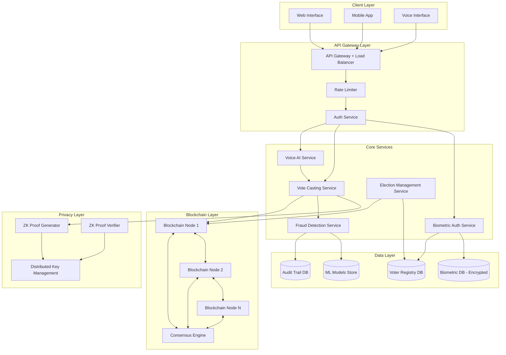

# Design Document: Advanced Online Voting System

## Overview

The Advanced Online Voting System is a distributed, secure voting platform that combines biometric authentication, blockchain technology, voice AI, zero-knowledge cryptography, and machine learning-based fraud detection. The system is designed to handle large-scale democratic elections with millions of concurrent voters while ensuring vote integrity, voter anonymity, and accessibility.

The architecture follows a microservices pattern with five core modules:
- **Biometric Authentication Module**: Handles voter identity verification using fingerprint and facial recognition
- **Blockchain Ledger Module**: Maintains an immutable, distributed ledger of encrypted votes
- **Voice AI Module**: Provides natural language interaction in 22 Indian languages
- **Zero-Knowledge Privacy Module**: Ensures voter anonymity using zk-SNARK/zk-STARK protocols
- **Fraud Detection Module**: Identifies suspicious patterns using machine learning

The system prioritizes security (end-to-end encryption, multi-factor authentication), privacy (zero-knowledge proofs, vote anonymization), accessibility (voice interface, WCAG 2.1 AA compliance), and scalability (horizontal scaling, 10M concurrent users).

## Architecture

### High-Level Architecture



### System Components

1. **Client Layer**: Multi-platform interfaces (web, mobile, voice) with accessibility features
2. **API Gateway**: Entry point with load balancing, rate limiting, and authentication
3. **Core Services**: Microservices handling specific domain logic
4. **Blockchain Layer**: Distributed ledger with consensus mechanism
5. **Privacy Layer**: Zero-knowledge proof generation and verification
6. **Data Layer**: Encrypted databases for voter data, biometrics, and audit trails

### Technology Stack

- **Frontend**: React (web), React Native (mobile), Web Speech API (voice)
- **API Gateway**: Kong or AWS API Gateway with rate limiting
- **Backend Services**: Node.js/TypeScript or Python (FastAPI)
- **Blockchain**: Hyperledger Fabric or custom blockchain with PBFT consensus
- **Zero-Knowledge**: libsnark (zk-SNARKs) or StarkWare (zk-STARKs)
- **Voice AI**: Google Cloud Speech-to-Text, custom NLU models
- **Biometrics**: OpenCV for facial recognition, custom fingerprint matching
- **Fraud Detection**: TensorFlow/PyTorch for ML models
- **Databases**: PostgreSQL (voter registry), MongoDB (audit logs), Redis (caching)
- **Encryption**: AES-256-GCM, TLS 1.3, RSA-4096 for key exchange

## Components and Interfaces

### 1. Biometric Authentication Module

**Purpose**: Verify voter identity using multi-modal biometrics (fingerprint + facial recognition)

**Components**:
- `BiometricCapture`: Captures biometric data from sensors
- `BiometricMatcher`: Compares captured data against stored templates
- `TemplateEncryptor`: Encrypts/decrypts biometric templates using AES-256
- `TokenGenerator`: Creates time-limited authentication tokens (JWT)
- `AccountLockManager`: Manages failed attempt tracking and account locking

**Interfaces**:

```typescript
interface BiometricAuthService {
  // Capture and authenticate voter
  authenticate(voterId: string, biometricData: BiometricData): Promise<AuthResult>
  
  // Register new voter biometrics
  registerBiometric(voterId: string, biometricData: BiometricData): Promise<RegistrationResult>
  
  // Validate authentication token
  validateToken(token: string): Promise<TokenValidation>
  
  // Lock/unlock voter account
  lockAccount(voterId: string, durationHours: number): Promise<void>
  unlockAccount(voterId: string): Promise<void>
}

interface BiometricData {
  fingerprint: FingerprintData
  facialImage: FacialData
  timestamp: Date
  deviceId: string
}

interface AuthResult {
  success: boolean
  token?: string
  expiresAt?: Date
  failureReason?: string
  attemptsRemaining?: number
}

interface FingerprintData {
  minutiae: number[][]  // Fingerprint feature points
  quality: number       // Quality score 0-100
}

interface FacialData {
  embedding: number[]   // 128-dimensional face embedding
  quality: number
}
```

**Data Flow**:
1. Voter provides biometric data via sensor
2. `BiometricCapture` validates data quality
3. `BiometricMatcher` retrieves encrypted template from database
4. `TemplateEncryptor` decrypts template
5. Matching algorithm compares data (99.9% accuracy threshold)
6. On success: `TokenGenerator` creates JWT token (15-minute expiry)
7. On failure: `AccountLockManager` tracks attempts, locks after 3 failures

### 2. Blockchain Ledger Module

**Purpose**: Maintain immutable, distributed ledger of encrypted votes with consensus

**Components**:
- `BlockBuilder`: Constructs new blocks with vote records
- `ConsensusEngine`: Implements PBFT (Practical Byzantine Fault Tolerance) consensus
- `ChainValidator`: Validates blockchain integrity
- `P2PNetwork`: Manages peer-to-peer communication between nodes
- `BlockStorage`: Persists blocks to disk

**Interfaces**:

```typescript
interface BlockchainService {
  // Add encrypted vote to blockchain
  addVote(encryptedVote: EncryptedVote, zkProof: ZKProof): Promise<BlockReceipt>
  
  // Verify vote inclusion
  verifyVoteInclusion(receiptId: string): Promise<InclusionProof>
  
  // Get blockchain statistics
  getChainStats(): Promise<ChainStatistics>
  
  // Validate entire chain integrity
  validateChain(): Promise<ValidationResult>
}

interface EncryptedVote {
  voteCommitment: string    // Zero-knowledge commitment
  timestamp: Date
  electionId: string
  encryptedPayload: Buffer  // AES-256 encrypted vote data
}

interface Block {
  index: number
  timestamp: Date
  votes: EncryptedVote[]
  previousHash: string
  hash: string              // SHA-256 hash
  nonce: number
  merkleRoot: string        // Merkle tree root of votes
}

interface BlockReceipt {
  blockIndex: number
  voteIndex: number
  receiptId: string
  merkleProof: string[]     // Merkle path for verification
  timestamp: Date
}

interface ConsensusMessage {
  type: 'PRE_PREPARE' | 'PREPARE' | 'COMMIT'
  blockHash: string
  nodeId: string
  signature: string
}
```

**Consensus Algorithm** (PBFT):
1. Primary node receives vote, creates block
2. Primary broadcasts PRE-PREPARE message
3. Replicas validate and send PREPARE messages
4. After receiving 2f+1 PREPARE messages, nodes send COMMIT
5. After receiving 2f+1 COMMIT messages, block is finalized
6. Block distributed to all nodes (67% consensus required)

### 3. Voice AI Module

**Purpose**: Provide natural language voice interface in 22 Indian languages

**Components**:
- `SpeechRecognizer`: Converts speech to text (Google Cloud Speech-to-Text)
- `NLUEngine`: Understands intent and extracts entities
- `DialogManager`: Manages conversation flow and context
- `TextToSpeech`: Converts responses to speech
- `LanguageDetector`: Identifies spoken language

**Interfaces**:

```typescript
interface VoiceAIService {
  // Process voice command
  processVoiceCommand(audioData: AudioBuffer, sessionId: string): Promise<VoiceResponse>
  
  // Get candidate information via voice
  getCandidateInfo(electionId: string, language: string): Promise<AudioBuffer>
  
  // Confirm vote selection via voice
  confirmVoteSelection(candidateId: string, sessionId: string): Promise<ConfirmationResult>
  
  // Set preferred language
  setLanguage(sessionId: string, language: SupportedLanguage): Promise<void>
}

interface AudioBuffer {
  data: Buffer
  format: 'wav' | 'mp3' | 'opus'
  sampleRate: number
  duration: number
}

interface VoiceResponse {
  intent: Intent
  entities: Entity[]
  responseText: string
  responseAudio: AudioBuffer
  confidence: number
}

interface Intent {
  name: 'SELECT_CANDIDATE' | 'GET_INFO' | 'CONFIRM_VOTE' | 'CANCEL' | 'HELP'
  confidence: number
}

interface Entity {
  type: 'CANDIDATE_NAME' | 'PARTY_NAME' | 'CONFIRMATION'
  value: string
  confidence: number
}

type SupportedLanguage = 
  'hindi' | 'english' | 'bengali' | 'telugu' | 'marathi' | 'tamil' | 
  'gujarati' | 'urdu' | 'kannada' | 'odia' | 'malayalam' | 'punjabi' |
  'assamese' | 'maithili' | 'santali' | 'kashmiri' | 'nepali' | 'sindhi' |
  'konkani' | 'dogri' | 'manipuri' | 'bodo'
```

**Voice Processing Pipeline**:
1. Audio captured from microphone (handle 10 dB SNR)
2. `LanguageDetector` identifies language
3. `SpeechRecognizer` converts to text (95% accuracy target)
4. `NLUEngine` extracts intent and entities
5. `DialogManager` determines appropriate response
6. `TextToSpeech` generates audio response
7. Audio played back to voter (< 1 second latency)

### 4. Zero-Knowledge Privacy Module

**Purpose**: Ensure voter anonymity while proving vote validity using zk-SNARKs/zk-STARKs

**Components**:
- `ProofGenerator`: Creates zero-knowledge proofs of vote validity
- `ProofVerifier`: Verifies proofs without learning vote content
- `CommitmentScheme`: Generates cryptographic commitments
- `DistributedKeyManager`: Manages threshold encryption keys
- `HomomorphicTally`: Enables encrypted vote tallying

**Interfaces**:

```typescript
interface ZKPrivacyService {
  // Generate zero-knowledge proof for vote
  generateVoteProof(vote: Vote, voterToken: string): Promise<ZKProofPackage>
  
  // Verify vote proof without revealing content
  verifyVoteProof(proof: ZKProof, commitment: string): Promise<VerificationResult>
  
  // Create vote commitment
  createCommitment(vote: Vote, randomness: string): Promise<Commitment>
  
  // Tally votes homomorphically
  tallyEncryptedVotes(voteCommitments: Commitment[]): Promise<TallyResult>
  
  // Generate voter receipt
  generateReceipt(voteProof: ZKProof): Promise<VoterReceipt>
}

interface Vote {
  candidateId: string
  electionId: string
  timestamp: Date
}

interface ZKProofPackage {
  proof: ZKProof
  commitment: Commitment
  publicInputs: PublicInputs
}

interface ZKProof {
  pi_a: string[]      // Proof component A
  pi_b: string[][]    // Proof component B
  pi_c: string[]      // Proof component C
  protocol: 'groth16' | 'plonk' | 'stark'
}

interface Commitment {
  value: string       // Pedersen commitment
  electionId: string
  timestamp: Date
}

interface PublicInputs {
  electionId: string
  validCandidateSet: string  // Merkle root of valid candidates
  voterEligibility: string   // Proof of voter eligibility
}

interface VoterReceipt {
  receiptId: string
  commitment: string
  timestamp: Date
  verificationUrl: string
}
```

**Zero-Knowledge Protocol**:
1. Voter selects candidate
2. System generates random blinding factor
3. `CommitmentScheme` creates Pedersen commitment: C = g^vote * h^randomness
4. `ProofGenerator` creates zk-SNARK proof proving:
   - Vote is for a valid candidate
   - Voter is eligible
   - Vote is properly formed
   - Without revealing which candidate or voter identity
5. Proof verified in < 100ms
6. Commitment stored on blockchain
7. During tallying, homomorphic properties allow counting without decryption

### 5. Fraud Detection Module

**Purpose**: Identify suspicious voting patterns using machine learning

**Components**:
- `PatternAnalyzer`: Analyzes voting patterns in real-time
- `AnomalyDetector`: ML model detecting anomalous behavior
- `BiometricDuplicateDetector`: Identifies duplicate biometric attempts
- `NetworkAnalyzer`: Detects IP-based anomalies
- `FraudScorer`: Calculates fraud risk scores

**Interfaces**:

```typescript
interface FraudDetectionService {
  // Analyze vote for fraud indicators
  analyzVote(voteContext: VoteContext): Promise<FraudAnalysis>
  
  // Detect duplicate biometric attempts
  checkBiometricDuplicates(biometricData: BiometricData): Promise<DuplicateCheckResult>
  
  // Monitor real-time fraud patterns
  getRealtimeFraudStats(): Promise<FraudStatistics>
  
  // Update fraud detection models
  updateMLModels(trainingData: FraudTrainingData): Promise<ModelUpdateResult>
  
  // Flag vote for manual review
  flagForReview(voteId: string, reason: string): Promise<void>
}

interface VoteContext {
  voterId: string
  timestamp: Date
  ipAddress: string
  deviceFingerprint: string
  biometricConfidence: number
  votingDuration: number
  previousVoteAttempts: number
}

interface FraudAnalysis {
  fraudScore: number        // 0.0 to 1.0
  riskLevel: 'LOW' | 'MEDIUM' | 'HIGH' | 'CRITICAL'
  indicators: FraudIndicator[]
  requiresReview: boolean
  confidence: number
}

interface FraudIndicator {
  type: 'DUPLICATE_BIOMETRIC' | 'IP_ANOMALY' | 'TIMING_ANOMALY' | 
        'BEHAVIORAL_ANOMALY' | 'MULTIPLE_ATTEMPTS'
  severity: number
  description: string
  evidence: any
}

interface FraudStatistics {
  totalVotes: number
  flaggedVotes: number
  confirmedFraud: number
  falsePositives: number
  averageFraudScore: number
  topIndicators: FraudIndicator[]
  updateTimestamp: Date
}
```

**ML Model Architecture**:
- **Feature Engineering**: Extract 50+ features from vote context
  - Temporal: time of day, voting duration, time since registration
  - Behavioral: mouse movements, keystroke dynamics, hesitation patterns
  - Network: IP geolocation, VPN detection, device fingerprint
  - Biometric: confidence scores, template quality, matching speed
- **Model**: Gradient Boosting (XGBoost) + Neural Network ensemble
- **Training**: Historical fraud data + synthetic fraud scenarios
- **Inference**: Real-time scoring < 50ms
- **Threshold**: Fraud score > 0.8 triggers manual review

### 6. Vote Casting Service

**Purpose**: Orchestrate the complete vote casting workflow

**Interfaces**:

```typescript
interface VoteCastingService {
  // Initialize voting session
  startVotingSession(authToken: string, electionId: string): Promise<VotingSession>
  
  // Select candidate
  selectCandidate(sessionId: string, candidateId: string): Promise<SelectionResult>
  
  // Confirm and submit vote
  confirmVote(sessionId: string): Promise<VoteSubmissionResult>
  
  // Cancel voting session
  cancelSession(sessionId: string): Promise<void>
  
  // Get voting status
  getVotingStatus(voterId: string, electionId: string): Promise<VotingStatus>
}

interface VotingSession {
  sessionId: string
  voterId: string
  electionId: string
  startTime: Date
  expiresAt: Date
  currentSelection?: string
  state: 'ACTIVE' | 'CONFIRMED' | 'CANCELLED' | 'EXPIRED'
}

interface VoteSubmissionResult {
  success: boolean
  receipt: VoterReceipt
  blockReceipt: BlockReceipt
  confirmationMessage: string
}

interface VotingStatus {
  hasVoted: boolean
  voteTimestamp?: Date
  receiptId?: string
  canVote: boolean
  reason?: string
}
```

**Vote Casting Workflow**:
1. Voter authenticates via `BiometricAuthService`
2. `VoteCastingService.startVotingSession()` creates session
3. Voter browses candidates (via UI or `VoiceAIService`)
4. Voter selects candidate: `selectCandidate()`
5. System displays selection for review
6. Voter confirms (visual + voice confirmation)
7. `ZKPrivacyService.generateVoteProof()` creates proof
8. `FraudDetectionService.analyzeVote()` checks for fraud
9. If fraud score < 0.8: proceed, else flag for review
10. `BlockchainService.addVote()` records on blockchain
11. System generates receipt
12. Voter receives cryptographic receipt
13. Session closed, token invalidated

## Data Models

### Voter

```typescript
interface Voter {
  voterId: string              // UUID
  nationalId: string           // Aadhaar or equivalent
  name: string
  dateOfBirth: Date
  constituency: string
  registrationDate: Date
  biometricTemplateId: string  // Reference to encrypted template
  status: 'ACTIVE' | 'SUSPENDED' | 'LOCKED'
  eligibleElections: string[]
}
```

### BiometricTemplate

```typescript
interface BiometricTemplate {
  templateId: string
  voterId: string
  fingerprintTemplate: Buffer  // Encrypted minutiae data
  facialEmbedding: Buffer      // Encrypted 128-d vector
  encryptionKey: string        // Encrypted with master key
  createdAt: Date
  lastUpdated: Date
}
```

### Election

```typescript
interface Election {
  electionId: string
  name: string
  type: 'GENERAL' | 'STATE' | 'LOCAL' | 'REFERENDUM'
  startTime: Date
  endTime: Date
  constituencies: string[]
  candidates: Candidate[]
  blockchainId: string         // Reference to blockchain instance
  fraudThreshold: number       // Custom fraud score threshold
  status: 'SCHEDULED' | 'ACTIVE' | 'CLOSED' | 'TALLYING' | 'COMPLETED'
}
```

### Candidate

```typescript
interface Candidate {
  candidateId: string
  name: string
  party: string
  symbol: string
  constituency: string
  biography: string
  photoUrl: string
}
```

### AuditLog

```typescript
interface AuditLog {
  logId: string
  timestamp: Date
  eventType: string
  actorId: string              // Voter or admin ID
  action: string
  resourceId: string
  ipAddress: string
  deviceFingerprint: string
  result: 'SUCCESS' | 'FAILURE'
  details: any
  signature: string            // Tamper-evident signature
}
```

### VoteRecord (On Blockchain)

```typescript
interface VoteRecord {
  recordId: string
  electionId: string
  commitment: string           // ZK commitment
  zkProof: ZKProof
  encryptedVote: Buffer        // Encrypted with threshold encryption
  timestamp: Date
  blockIndex: number
  merkleProof: string[]
}
```

## Data Models

### Database Schema

**Voter Registry Database (PostgreSQL)**:
```sql
CREATE TABLE voters (
  voter_id UUID PRIMARY KEY,
  national_id VARCHAR(12) UNIQUE NOT NULL,
  name VARCHAR(255) NOT NULL,
  date_of_birth DATE NOT NULL,
  constituency VARCHAR(100) NOT NULL,
  registration_date TIMESTAMP NOT NULL,
  biometric_template_id UUID NOT NULL,
  status VARCHAR(20) NOT NULL,
  created_at TIMESTAMP DEFAULT NOW(),
  updated_at TIMESTAMP DEFAULT NOW()
);

CREATE TABLE elections (
  election_id UUID PRIMARY KEY,
  name VARCHAR(255) NOT NULL,
  type VARCHAR(50) NOT NULL,
  start_time TIMESTAMP NOT NULL,
  end_time TIMESTAMP NOT NULL,
  blockchain_id VARCHAR(100) NOT NULL,
  fraud_threshold DECIMAL(3,2) DEFAULT 0.80,
  status VARCHAR(20) NOT NULL,
  created_at TIMESTAMP DEFAULT NOW()
);

CREATE TABLE candidates (
  candidate_id UUID PRIMARY KEY,
  election_id UUID REFERENCES elections(election_id),
  name VARCHAR(255) NOT NULL,
  party VARCHAR(100) NOT NULL,
  symbol VARCHAR(100) NOT NULL,
  constituency VARCHAR(100) NOT NULL,
  biography TEXT,
  photo_url VARCHAR(500)
);

CREATE TABLE voting_sessions (
  session_id UUID PRIMARY KEY,
  voter_id UUID REFERENCES voters(voter_id),
  election_id UUID REFERENCES elections(election_id),
  start_time TIMESTAMP NOT NULL,
  expires_at TIMESTAMP NOT NULL,
  current_selection UUID,
  state VARCHAR(20) NOT NULL,
  ip_address INET,
  device_fingerprint VARCHAR(255)
);

CREATE INDEX idx_voters_national_id ON voters(national_id);
CREATE INDEX idx_voting_sessions_voter ON voting_sessions(voter_id, election_id);
CREATE INDEX idx_candidates_election ON candidates(election_id);
```

**Biometric Database (Encrypted, PostgreSQL)**:
```sql
CREATE TABLE biometric_templates (
  template_id UUID PRIMARY KEY,
  voter_id UUID NOT NULL,
  fingerprint_template BYTEA NOT NULL,  -- AES-256 encrypted
  facial_embedding BYTEA NOT NULL,      -- AES-256 encrypted
  encryption_key_id VARCHAR(100) NOT NULL,
  quality_score INTEGER NOT NULL,
  created_at TIMESTAMP DEFAULT NOW(),
  last_updated TIMESTAMP DEFAULT NOW()
);

CREATE TABLE authentication_attempts (
  attempt_id UUID PRIMARY KEY,
  voter_id UUID NOT NULL,
  timestamp TIMESTAMP NOT NULL,
  success BOOLEAN NOT NULL,
  failure_reason VARCHAR(255),
  biometric_confidence DECIMAL(5,4),
  ip_address INET,
  device_id VARCHAR(255)
);

CREATE INDEX idx_biometric_voter ON biometric_templates(voter_id);
CREATE INDEX idx_auth_attempts_voter ON authentication_attempts(voter_id, timestamp DESC);
```

**Audit Trail Database (MongoDB)**:
```javascript
{
  _id: ObjectId,
  logId: UUID,
  timestamp: ISODate,
  eventType: String,  // "AUTHENTICATION", "VOTE_CAST", "FRAUD_DETECTED", etc.
  actorId: String,
  action: String,
  resourceId: String,
  ipAddress: String,
  deviceFingerprint: String,
  result: String,     // "SUCCESS" or "FAILURE"
  details: Object,
  signature: String,  // HMAC signature for tamper detection
  indexed: true
}

// Indexes
db.audit_logs.createIndex({ timestamp: -1 })
db.audit_logs.createIndex({ actorId: 1, timestamp: -1 })
db.audit_logs.createIndex({ eventType: 1, timestamp: -1 })
```

**Blockchain Storage (Custom Format)**:
- Each block stored as binary file on disk
- Merkle tree for efficient vote verification
- Distributed across all nodes
- Immutable append-only structure

## Error Handling

### Error Categories

1. **Authentication Errors**
   - `BIOMETRIC_MISMATCH`: Biometric data doesn't match template
   - `ACCOUNT_LOCKED`: Account locked due to failed attempts
   - `TOKEN_EXPIRED`: Authentication token expired
   - `TOKEN_INVALID`: Invalid or tampered token

2. **Voting Errors**
   - `ALREADY_VOTED`: Voter has already cast vote in this election
   - `ELECTION_NOT_ACTIVE`: Election not in active state
   - `INVALID_CANDIDATE`: Selected candidate not valid for voter's constituency
   - `SESSION_EXPIRED`: Voting session timed out
   - `FRAUD_DETECTED`: High fraud score, vote flagged

3. **Blockchain Errors**
   - `CONSENSUS_FAILURE`: Failed to achieve 67% consensus
   - `BLOCK_INVALID`: Block validation failed
   - `CHAIN_CORRUPTED`: Blockchain integrity check failed
   - `NODE_UNREACHABLE`: Cannot reach required number of nodes

4. **Privacy Errors**
   - `PROOF_GENERATION_FAILED`: ZK proof generation error
   - `PROOF_VERIFICATION_FAILED`: ZK proof verification failed
   - `COMMITMENT_INVALID`: Vote commitment validation failed

5. **System Errors**
   - `SERVICE_UNAVAILABLE`: Service temporarily unavailable
   - `RATE_LIMIT_EXCEEDED`: Too many requests from voter
   - `DATABASE_ERROR`: Database operation failed
   - `NETWORK_ERROR`: Network connectivity issue

### Error Handling Strategy

**Retry Logic**:
- Transient errors (network, temporary unavailability): Exponential backoff, max 3 retries
- Blockchain consensus failures: Retry with different primary node
- Database deadlocks: Automatic retry with jitter

**Graceful Degradation**:
- If voice AI unavailable: Fall back to visual interface
- If single blockchain node fails: Continue with remaining nodes
- If fraud detection slow: Queue for async analysis, allow vote with flag

**Error Recovery**:
- Vote submission failures: Queue vote locally, retry when connectivity restored
- Session expiry during voting: Allow session extension once
- Biometric capture failures: Offer alternative biometric modality

**Error Responses**:
```typescript
interface ErrorResponse {
  error: {
    code: string
    message: string
    details?: any
    retryable: boolean
    retryAfter?: number  // seconds
    supportContact?: string
  }
  requestId: string
  timestamp: Date
}
```

**Logging and Monitoring**:
- All errors logged to audit trail
- Critical errors trigger immediate alerts
- Error rates monitored per service
- Automated incident response for system-wide failures

### Security Error Handling

**Attack Detection**:
- Repeated authentication failures → Account lock + admin alert
- Unusual voting patterns → Fraud detection escalation
- Blockchain tampering attempts → Node isolation + forensic logging
- DDoS patterns → Rate limiting + IP blocking

**Data Breach Response**:
1. Immediate service suspension
2. Forensic analysis of breach scope
3. Notification to Election Commission within 2 hours
4. Voter notification if personal data compromised
5. Security patch deployment
6. Post-incident review and system hardening


## Correctness Properties

A property is a characteristic or behavior that should hold true across all valid executions of a system—essentially, a formal statement about what the system should do. Properties serve as the bridge between human-readable specifications and machine-verifiable correctness guarantees.

The following properties are derived from the acceptance criteria in the requirements document. Each property is universally quantified and designed to be tested using property-based testing frameworks.

### Property 1: Biometric Matching Accuracy

*For any* registered voter with a valid biometric template, when authentic biometric data is provided, the matching algorithm should correctly identify it as a match with 99.9% accuracy, and when non-matching biometric data is provided, it should correctly reject it with 99.9% accuracy.

**Validates: Requirements 1.2, 12.4**

### Property 2: Authentication Token Validity

*For any* successful biometric authentication, the generated authentication token should be valid for exactly 15 minutes from issuance and should contain the correct voter ID.

**Validates: Requirements 1.3**

### Property 3: Token Invalidation on Re-authentication

*For any* voter, when a new authentication succeeds, all previously issued authentication tokens for that voter should become invalid immediately.

**Validates: Requirements 1.7**

### Property 4: Data Encryption at Rest

*For any* sensitive data (biometric templates, vote records, personal information), the stored representation should be encrypted using AES-256-GCM, and decryption should recover the original data exactly.

**Validates: Requirements 1.5, 10.2, 12.2**

### Property 5: Blockchain Chain Integrity

*For any* sequence of blocks in the blockchain, each block (except genesis) should contain a hash that correctly references the previous block's hash using SHA-256, forming an unbroken chain.

**Validates: Requirements 2.2**

### Property 6: Vote Record Structure Completeness

*For any* vote cast, the created vote record should contain all required fields: encrypted payload, timestamp, election ID, ZK commitment, and cryptographic hash.

**Validates: Requirements 2.1**

### Property 7: Blockchain Consensus Requirement

*For any* vote record, it should only be finalized and added to the blockchain when at least 67% of active nodes have reached consensus.

**Validates: Requirements 2.4**

### Property 8: Blockchain Tamper Detection

*For any* block in the blockchain, if any field is modified after finalization, the hash verification should fail and the block should be rejected.

**Validates: Requirements 2.5**

### Property 9: Audit Trail Completeness

*For any* system transaction (authentication, vote casting, configuration change), a corresponding audit log entry should exist with all required fields and a valid tamper-evident signature.

**Validates: Requirements 2.6, 10.6**

### Property 10: Vote Inclusion Proof Validity

*For any* vote recorded on the blockchain, the system should generate a valid Merkle proof that can cryptographically verify the vote's inclusion in the blockchain without revealing vote content.

**Validates: Requirements 2.7**

### Property 11: Voice Recognition Accuracy

*For any* valid voice command in any of the 22 supported languages, the voice AI module should recognize the intent with at least 95% accuracy when provided with clear audio input.

**Validates: Requirements 3.1**

### Property 12: Voice Feedback Provision

*For any* system action during voice interaction, audio feedback should be generated and provided to the voter.

**Validates: Requirements 3.2**

### Property 13: Multilingual Candidate Information

*For any* candidate and any supported language, when candidate information is requested, the voice AI should provide the information in the requested language.

**Validates: Requirements 3.3**

### Property 14: Voice Data Privacy

*For any* voice input processed by the system, after processing is complete, no raw audio data should remain in memory or persistent storage.

**Validates: Requirements 3.7**

### Property 15: Zero-Knowledge Proof Round-Trip

*For any* valid vote, generating a ZK proof and then verifying it should succeed, proving vote validity without revealing the vote content or voter identity.

**Validates: Requirements 4.1, 4.3**

### Property 16: Vote Anonymity

*For any* vote record stored on the blockchain, the record should contain no fields that can be linked to voter identity (no voter ID, name, biometric data, or other identifying information).

**Validates: Requirements 4.2**

### Property 17: Homomorphic Tally Correctness

*For any* set of encrypted votes, tallying them homomorphically should produce the same result as decrypting each vote individually and counting, without revealing individual vote choices during the tallying process.

**Validates: Requirements 4.5**

### Property 18: Invalid Proof Rejection

*For any* invalid or tampered ZK proof, the verification process should reject it and create an audit log entry that does not contain voter identity information.

**Validates: Requirements 4.7**

### Property 19: Fraud Score Calculation

*For any* vote context, the fraud detection module should calculate a fraud score in the valid range [0.0, 1.0] based on the provided behavioral and temporal patterns.

**Validates: Requirements 5.1**

### Property 20: Fraud Threshold Flagging

*For any* vote with a fraud score exceeding the configured threshold (default 0.8), the vote should be flagged for manual review and an alert should be sent to election administrators.

**Validates: Requirements 5.2**

### Property 21: Duplicate Biometric Detection

*For any* two biometric authentication or registration attempts, if the biometric templates match (same person), the system should detect them as duplicates with 99.5% accuracy.

**Validates: Requirements 5.3**

### Property 22: IP Address Anomaly Detection

*For any* set of votes from the same IP address within a 1-minute window, the fraud detection module should identify and flag this pattern as suspicious.

**Validates: Requirements 5.4**

### Property 23: Suspicious Account Suspension

*For any* voter account that exhibits suspicious activity patterns (high fraud score, multiple failed attempts, anomalous behavior), the system should temporarily suspend voting capability and require additional verification.

**Validates: Requirements 5.6**

### Property 24: Selection Change Flexibility

*For any* voting session before final confirmation, the voter should be able to change their candidate selection an unlimited number of times, with each change properly recorded in the session state.

**Validates: Requirements 6.2**

### Property 25: Cryptographic Receipt Generation

*For any* successfully recorded vote, the system should generate a cryptographic receipt that can prove vote inclusion in the blockchain without revealing the vote content.

**Validates: Requirements 6.4**

### Property 26: Single Vote Per Election Invariant

*For any* voter and any election, the system should prevent and reject any attempt to cast more than one vote, ensuring exactly one vote per voter per election.

**Validates: Requirements 6.5**

### Property 27: Text Readability Standard

*For any* text displayed to voters, the Flesch Reading Ease score should be above 60, ensuring accessibility for voters with varying literacy levels.

**Validates: Requirements 7.5**

### Property 28: Election Isolation

*For any* two concurrent elections, votes cast in one election should be stored on a separate blockchain ledger and should not interfere with or be accessible from the other election.

**Validates: Requirements 8.2, 8.6**

### Property 29: Election Start Time Validation

*For any* election configuration, if the start time is less than 24 hours in the future, the system should reject the configuration with a validation error.

**Validates: Requirements 8.3**

### Property 30: Custom Fraud Threshold Application

*For any* election with a custom fraud score threshold, votes in that election should be evaluated against the custom threshold rather than the default threshold.

**Validates: Requirements 8.4**

### Property 31: Automatic Election Closure

*For any* election, when the configured end time is reached, the system should automatically transition the election state to "CLOSED" and begin the tallying process.

**Validates: Requirements 8.5**

### Property 32: Multi-Signature Authorization

*For any* critical configuration change (election parameters, fraud thresholds, system settings), the change should only be applied when authorized by at least 3 different election administrator accounts.

**Validates: Requirements 8.7**

### Property 33: Distributed Key Tallying

*For any* election tallying process, vote decryption should require combining key shares from multiple nodes, ensuring no single node can decrypt votes independently.

**Validates: Requirements 9.1**

### Property 34: Verifiable Tally Correctness

*For any* completed election tally, the system should generate a cryptographic proof that the published vote totals are correct, and this proof should be independently verifiable.

**Validates: Requirements 9.2, 9.3**

### Property 35: Vote-Token Count Consistency

*For any* completed election, the total number of votes recorded should equal the number of valid authentication tokens issued for that election, and any discrepancy should be detected and reported.

**Validates: Requirements 9.5**

### Property 36: Voter Receipt Verification

*For any* voter with a receipt, they should be able to verify that their vote was included in the final tally using their receipt, without revealing which candidate they voted for.

**Validates: Requirements 9.6**

### Property 37: Security Breach Logging

*For any* detected security breach attempt (authentication attacks, tampering, unauthorized access), the system should create an audit log entry and send an alert to election administrators.

**Validates: Requirements 10.3**

### Property 38: Rate Limiting Enforcement

*For any* voter, if they exceed 10 requests per minute, subsequent requests should be rejected with a rate limit error until the rate falls below the threshold.

**Validates: Requirements 10.4**

### Property 39: Vote Preservation During Node Failure

*For any* vote in the process of being recorded, if a blockchain node fails, the vote should not be lost and should be successfully recorded once the system recovers or redistributes the load.

**Validates: Requirements 11.7**

### Property 40: Voter Eligibility Verification

*For any* voter registration attempt, the system should verify citizenship and age eligibility against the national identity database, and reject registrations that don't meet eligibility criteria.

**Validates: Requirements 12.1**

### Property 41: Unique Voter ID Assignment

*For any* successful voter registration, the system should assign a unique voter ID that is not used by any other voter in the system.

**Validates: Requirements 12.3**

### Property 42: Registration Update Re-verification

*For any* voter attempting to update their registration information, the system should require biometric re-verification before allowing the update.

**Validates: Requirements 12.7**

## Testing Strategy

The Advanced Online Voting System requires a comprehensive testing approach that combines unit testing, property-based testing, integration testing, and security testing. Given the critical nature of electoral systems, testing must ensure correctness, security, privacy, and accessibility.

### Testing Approach

**Dual Testing Strategy**:
- **Unit Tests**: Verify specific examples, edge cases, and error conditions
- **Property Tests**: Verify universal properties across all inputs using randomized testing
- Both approaches are complementary and necessary for comprehensive coverage

**Testing Philosophy**:
- Unit tests validate concrete scenarios and edge cases
- Property tests validate general correctness across large input spaces
- Integration tests validate component interactions
- Security tests validate attack resistance
- Accessibility tests validate WCAG compliance

### Property-Based Testing

**Framework Selection**:
- **TypeScript/JavaScript**: fast-check
- **Python**: Hypothesis
- **Go**: gopter
- **Rust**: proptest

**Configuration**:
- Minimum 100 iterations per property test (due to randomization)
- Increased to 1000 iterations for critical security properties
- Shrinking enabled to find minimal failing examples
- Deterministic seed for reproducibility

**Property Test Tagging**:
Each property test must include a comment tag referencing the design document property:

```typescript
// Feature: advanced-voting-system, Property 1: Biometric Matching Accuracy
test('biometric matching accuracy property', async () => {
  await fc.assert(
    fc.asyncProperty(
      biometricTemplateArbitrary(),
      async (template) => {
        // Test implementation
      }
    ),
    { numRuns: 1000 }
  )
})
```

### Unit Testing Strategy

**Focus Areas**:
1. **Edge Cases**:
   - Account locking after exactly 3 failed authentication attempts (Req 1.4)
   - Voice AI fallback after 3 failed recognition attempts (Req 3.5)
   - Empty vote records, malformed data
   - Boundary conditions (exactly 15-minute token expiry, exactly 67% consensus)

2. **Error Conditions**:
   - Invalid biometric data format
   - Tampered blockchain blocks
   - Invalid ZK proofs
   - Network failures during vote submission
   - Database connection failures

3. **Integration Points**:
   - Biometric module → Token generator
   - Vote casting service → Blockchain service
   - ZK privacy module → Blockchain service
   - Fraud detection → Vote casting workflow

4. **Specific Examples**:
   - Registry page displays search interface (Req 8.1)
   - Voice confirmation flow repeats selection (Req 3.4)
   - Font size adjustment works (Req 7.2)
   - Keyboard navigation available (Req 7.4)
   - RTL text rendering (Req 7.6)
   - Bulk voter import (Req 12.6)
   - Audit report generation (Req 9.7)
   - TLS 1.3 usage (Req 10.1)

**Unit Test Balance**:
- Avoid writing too many unit tests for scenarios covered by property tests
- Focus unit tests on specific examples that demonstrate correct behavior
- Use unit tests for integration points and error handling
- Property tests handle comprehensive input coverage

### Test Data Generation

**Generators for Property Tests**:

```typescript
// Biometric data generator
const biometricDataArbitrary = () => fc.record({
  fingerprint: fc.record({
    minutiae: fc.array(fc.tuple(fc.integer(), fc.integer()), { minLength: 20, maxLength: 100 }),
    quality: fc.integer({ min: 0, max: 100 })
  }),
  facialImage: fc.record({
    embedding: fc.array(fc.float(), { minLength: 128, maxLength: 128 }),
    quality: fc.integer({ min: 0, max: 100 })
  }),
  timestamp: fc.date(),
  deviceId: fc.uuid()
})

// Vote generator
const voteArbitrary = (electionId: string, validCandidates: string[]) => 
  fc.record({
    candidateId: fc.constantFrom(...validCandidates),
    electionId: fc.constant(electionId),
    timestamp: fc.date()
  })

// Fraud context generator
const voteContextArbitrary = () => fc.record({
  voterId: fc.uuid(),
  timestamp: fc.date(),
  ipAddress: fc.ipV4(),
  deviceFingerprint: fc.hexaString({ minLength: 32, maxLength: 32 }),
  biometricConfidence: fc.float({ min: 0, max: 1 }),
  votingDuration: fc.integer({ min: 10, max: 300 }),
  previousVoteAttempts: fc.integer({ min: 0, max: 5 })
})

// Blockchain block generator
const blockArbitrary = (previousHash: string) => fc.record({
  index: fc.nat(),
  timestamp: fc.date(),
  votes: fc.array(encryptedVoteArbitrary(), { minLength: 1, maxLength: 100 }),
  previousHash: fc.constant(previousHash),
  nonce: fc.nat()
})
```

### Integration Testing

**Test Scenarios**:
1. **End-to-End Vote Casting**:
   - Authenticate → Select candidate → Confirm → Receive receipt
   - Verify vote appears on blockchain
   - Verify receipt can prove inclusion

2. **Voice-Based Voting Flow**:
   - Voice authentication → Voice candidate selection → Voice confirmation
   - Verify accessibility for visually impaired users

3. **Fraud Detection Integration**:
   - Cast vote with suspicious patterns
   - Verify fraud detection flags it
   - Verify vote queued for review

4. **Multi-Node Blockchain**:
   - Deploy 5 blockchain nodes
   - Cast votes and verify consensus
   - Simulate node failure and verify recovery

5. **Election Lifecycle**:
   - Create election → Open voting → Cast votes → Close election → Tally → Publish results
   - Verify all state transitions

### Security Testing

**Penetration Testing**:
- Authentication bypass attempts
- Blockchain tampering attempts
- ZK proof forgery attempts
- SQL injection, XSS, CSRF attacks
- DDoS simulation
- Man-in-the-middle attacks

**Cryptographic Verification**:
- Verify AES-256-GCM encryption strength
- Verify TLS 1.3 configuration
- Verify ZK proof soundness
- Verify hash function collision resistance

**Privacy Testing**:
- Attempt to link votes to voters
- Attempt to extract voter identity from blockchain
- Verify ZK proofs don't leak information
- Verify audit logs don't contain PII

### Accessibility Testing

**Automated Testing**:
- axe-core for WCAG 2.1 AA compliance
- Lighthouse accessibility audits
- Keyboard navigation testing

**Manual Testing**:
- Screen reader testing (NVDA, JAWS, VoiceOver)
- Voice interface testing with actual users
- High contrast mode verification
- Font size adjustment verification

### Performance Testing

**Load Testing**:
- Simulate 10 million concurrent voters
- Measure response times under load
- Verify auto-scaling triggers
- Test 50,000 votes per second throughput

**Stress Testing**:
- Push system beyond capacity
- Verify graceful degradation
- Verify no data loss under stress

**Endurance Testing**:
- Run system for 24+ hours under load
- Monitor for memory leaks
- Monitor for performance degradation

### Continuous Testing

**CI/CD Pipeline**:
1. Unit tests run on every commit
2. Property tests run on every PR
3. Integration tests run on merge to main
4. Security scans run nightly
5. Performance tests run weekly
6. Full penetration test before each election

**Test Coverage Goals**:
- Unit test coverage: > 80%
- Property test coverage: All 42 properties
- Integration test coverage: All critical paths
- Security test coverage: OWASP Top 10

### Test Environment

**Environments**:
1. **Development**: Local testing, fast feedback
2. **Staging**: Full system integration, mirrors production
3. **Pre-Production**: Final validation before election
4. **Production**: Live election with monitoring

**Test Data**:
- Synthetic voter data (no real PII)
- Synthetic biometric templates
- Synthetic vote patterns
- Historical fraud patterns (anonymized)

### Monitoring and Observability

**Metrics**:
- Authentication success/failure rates
- Vote casting latency (p50, p95, p99)
- Blockchain consensus time
- Fraud detection accuracy
- System uptime and availability

**Alerts**:
- Authentication failure spike
- Fraud score spike
- Blockchain consensus failure
- Node failure
- Security breach attempt

**Logging**:
- Structured logging (JSON format)
- Centralized log aggregation
- Tamper-evident audit logs
- PII redaction in logs

This comprehensive testing strategy ensures the Advanced Online Voting System meets its stringent requirements for security, privacy, accessibility, and correctness.
